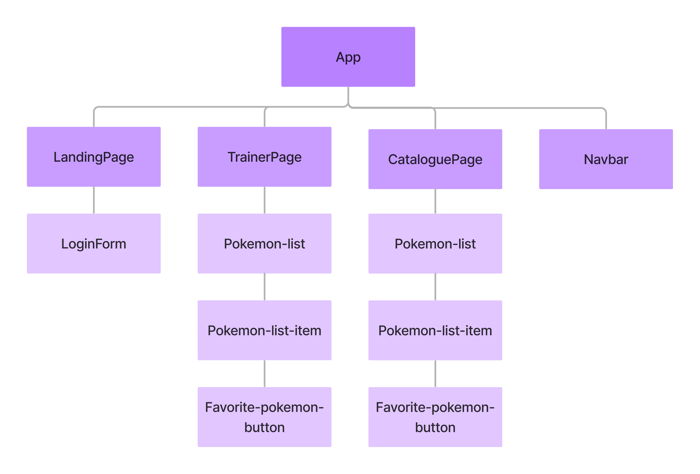

# Pokemon Trainer

## Website:
http://pokemon-trainer-drab.vercel.app

## Info:
The pokemon trainer app contains three pages: Landing, Catalogue and Trainer.  
All pages contain a navbar component that, when logged-in, allows navigation to different pages aswell as enabling the user to log-out.  
Both catalogue and trainer page are restricted by a guard service to disallow navigation unless the user is logged-in.

### Landing page
The landing page contains a login form component, where the user can create or log-in to the app.  
Log-in happens by inputting a username whereby the login service will check for an existing user in the API.  
If a user with the inputted username exist in the API, they will be logged-in by saving that user in session storage.  
The login service will create a new user (and save them in session storage) if a user with the inputted username doesn't exist.  
After log-in the user will be redirected to the catalogue page.  

### Catalogue page
A catalogue service is used to fetch a list of pokemons from the PokéAPI, with name and image.  
The pokemons are then added to a pokemon list component as individual pokemon list-item components, to display on the page.  
Every pokemon list-item components have an embedded favourite/collect button component.  
When the button is pressed a favourite service will be used to add or remove the associated pokemon from the user's personal collection.  
Pokemon are added and removed to the user's collection via the user service.  

### Trainer page
The trainer page reuses the pokemon list component to display pokemons much alike the catalogue page.  
However on the trainer page only the pokemon in the user's collection are displayed.  
Pokemon can, similarly to the catalogue page, be removed from the user's collection via the embedded favourite/collect button component.  

## Component-tree

